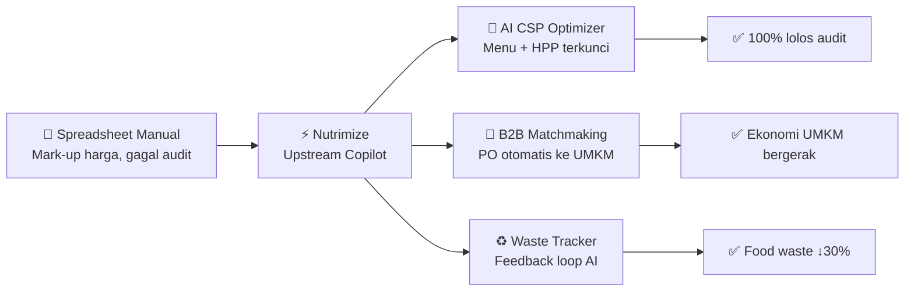
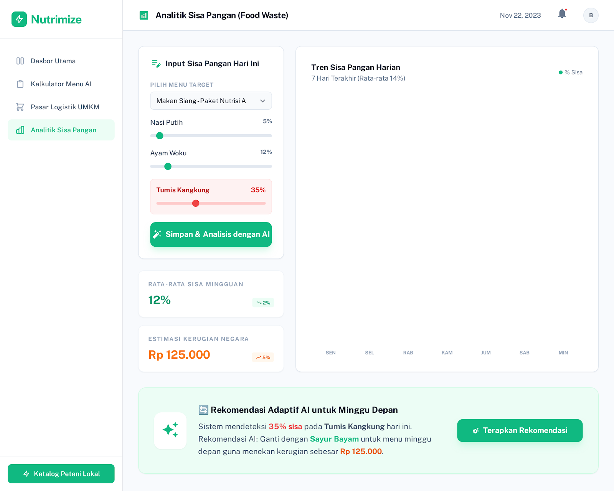
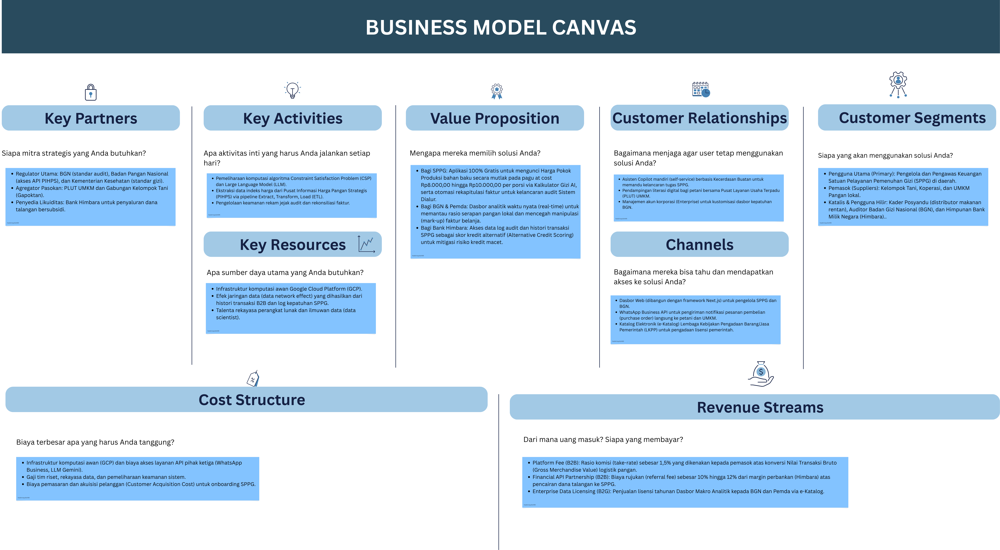

<div align="center">

# ⚡ Nutrimize

### Otomatisasi Menu Cerdas & B2B Matchmaking UMKM Lokal untuk Efisiensi Operasional Satuan Pelayanan Pemenuhan Gizi

[-22c55e?style=for-the-badge)](https://github.com/Hasbirizqulloh/nutrimize)
[]()
[-8b5cf6?style=for-the-badge)]()

[](https://nextjs.org/)
[](https://typescriptlang.org/)
[](https://postgresql.org/)
[](https://prisma.io/)
[]()

---

**SaaS ERP & Upstream Copilot** berbasis kecerdasan buatan yang membantu pengelola dapur Program Makan Bergizi Gratis (MBG) meracik menu gizi presisi, menghubungkan langsung ke UMKM lokal, dan menghasilkan laporan audit yang kebal manipulasi — dalam satu klik.s

<br/><br/>

<a href="https://drive.google.com/file/d/120Ye_bn68A-A8aNeW0o4ssv4QtIj56f9/view?usp=sharing" target="_blank">
  
  <br/><br/>
  
</a>
</div>

---

## 📋 Daftar Isi

- [Ringkasan Eksekutif](#-ringkasan-eksekutif)
- [Latar Belakang Masalah](#-latar-belakang-masalah)
- [Solusi: Nutrimize](#-solusi-nutrimize)
- [Arsitektur Sistem](#%EF%B8%8F-arsitektur-sistem)
- [Database Schema](#-database-schema)
- [Fitur Prototype](#-fitur-prototype-functional)
- [Alur Demo End-to-End](#-alur-demo-end-to-end)
- [Metrik Keberhasilan](#-metrik-keberhasilan-smart)
- [Model Bisnis](#-model-bisnis)
- [Skalabilitas](#-skalabilitas)
- [Roadmap](#-roadmap-pengembangan)
- [Tech Stack](#-tech-stack)
- [Menjalankan Prototype](#-menjalankan-prototype)
- [Tim Nalarwangsa](#-tim-nalarwangsa)
- [Lampiran](#-lampiran)

---

## 🎯 Ringkasan Eksekutif

Pengelola **Satuan Pelayanan Pemenuhan Gizi (SPPG)** menghadapi masalah kritis: **kerentanan manipulasi administrasi** dan **inefisiensi perencanaan hulu**. Penggunaan spreadsheet manual membuka celah mark-up harga faktur dan memicu kegagalan audit pelaporan, yang berakibat fatal pada **tertundanya pencairan dana reimbursement**.

**Nutrimize** hadir sebagai **SaaS ERP dan upstream copilot**. Sistem ini mengintegrasikan **Multi-Target AI CSP Optimizer** untuk merancang resep gizi dengan HPP terkunci mutlak maksimal **Rp10.000 per porsi**, yang otomatis dikonversi menjadi pesanan belanja langsung ke ekosistem UMKM lokal. Seluruh transaksi disinkronkan menjadi **log pelaporan audit baku yang kebal manipulasi**.

### Dampak Terukur

| Indikator | Target |
|-----------|--------|
| 🔒 Kelancaran audit pencairan dana | **100%** lolos tanpa revisi |
| ⏱️ Efisiensi waktu administrasi | **↓ 80%** (dari berjam-jam → < 30 detik) |
| 💰 Kepatuhan HPP at cost | **100%** terkunci Rp8.000–Rp10.000/porsi |
| ♻️ Reduksi food waste | **↓ 30%** via feedback loop AI |
| 🌾 Inklusi ekonomi UMKM | **142.387** pemasok lokal terhubung |

---

## 🔍 Latar Belakang Masalah

### Problem Statement
> **PENINGKATAN PRODUKTIVITAS, KETAHANAN PANGAN, DAN PENCIPTAAN LAPANGAN KERJA**
> Sub-problem: *Digitalisasi Ketahanan Pangan*

### Akar Masalah Spesifik

Berdasarkan **Petunjuk Teknis Badan Gizi Nasional (BGN)**, SPPG wajib meracik resep multi-target dengan pagu mutlak *at cost* **Rp8.000–Rp10.000** per porsi, lalu melaporkannya ke portal **Sistem Dialur** untuk pencairan dana reimbursement. Namun:

```
❌ Spreadsheet Manual (FOOD COST.xlsx)
   ├── Celah mark-up harga faktur (tanpa validasi harga riil)
   ├── Rekapitulasi ratusan nota UMKM rentan human error
   ├── Penolakan laporan di portal BGN
   └── Pencairan dana TERTUNDA → modal kerja TERKURAS → dapur LUMPUH
```

### Bukti Urgensi (Evidence of Demand)

- **29.225 SPPG** melayani **62,45 juta** penerima manfaat (per Mei 2026)
- **142.387 pemasok** lokal (59.921 UMKM + 13.306 koperasi) bertransaksi harian
- **Kasus SPPG Kalibata**: kerugian likuiditas **Rp975.375.000** akibat kegagalan audit administrasi — *tanpa pembayaran sepeser pun dari pemerintah*
- **Temuan ICW**: praktik mark-up harga faktur belanja (ayam Rp50.000 dicatat Rp55.000) karena ketiadaan validasi harga real-time

---

## 💡 Solusi: Nutrimize

Nutrimize memecahkan masalah melalui **tiga modul utama** yang saling terintegrasi:

### 1. 🧮 Kalkulator Gizi AI (Multi-Target CSP Optimizer)
Menggunakan algoritma **Constraint Satisfaction Problem** (Google OR-Tools) dan **Gemini Pro** untuk:
- Meracik resep gizi multi-target (siswa, balita, ibu hamil) dalam **< 100ms**
- Mengunci HPP mutlak di bawah batas **Rp10.000/porsi at cost**
- Melakukan **substitusi cerdas otomatis** saat harga bahan naik (contoh: ayam → ikan tongkol lokal) dengan kesetaraan nutrisi absolut

### 2. 🛒 Pasar Logistik UMKM (B2B Matchmaking)
- Mengonversi matriks gizi menjadi **Purchase Order** langsung ke mitra pemasok lokal
- Mencocokkan bahan pangan dengan supplier terverifikasi dalam **radius 10km**
- Transmisi PO otomatis via **WhatsApp Business API** — petani tidak perlu install aplikasi baru
- Seluruh nota otomatis **terekonsiliasi** menjadi format laporan audit baku

### 3. ♻️ Smart Waste Tracker (Feedback Loop)
- Input sisa pangan harian per item menu
- AI menganalisis pola dan merekomendasikan **substitusi menu adaptif** untuk minggu depan
- Menekan food waste hingga **30%** melalui *continuous improvement*

### Problem → Solution → Outcome Mapping



---

## 🏗️ Arsitektur Sistem

Sistem dibangun dengan arsitektur **microservices asinkron** di atas komputasi awan:

```
┌─────────────────────────────────────────────────────────────────┐
│                     INPUT & DATA INGESTION                      │
│                                                                 │
│  ┌──────────────┐  ┌─────────────────┐  ┌───────────────────┐  │
│  │ SPPG Manager │  │ PIHPS API       │  │ Local Supplier &  │  │
│  │ Input Budget │  │ Real-time       │  │ MSME Database     │  │
│  │ & Portions   │  │ Market Prices   │  │                   │  │
│  └──────┬───────┘  └────────┬────────┘  └────────┬──────────┘  │
└─────────┼──────────────────┼────────────────────┼──────────────┘
          │                  │                    │
          ▼                  ▼                    ▼
┌─────────────────────────────────────────────────────────────────┐
│                    AI PROCESSING ENGINE                          │
│                                                                 │
│  ┌──────────────────────┐    ┌─────────────────────────────┐   │
│  │  AI CSP Optimizer    │◄──►│  LLM Gemini Pro             │   │
│  │  (Google OR-Tools)   │    │  (Function Calling &        │   │
│  │  Multi-target nutri- │    │   Dynamic Substitution)     │   │
│  │  tion + cost lock    │    │                             │   │
│  └──────────┬───────────┘    └─────────────────────────────┘   │
└─────────────┼──────────────────────────────────────────────────┘
              │
              ▼
┌─────────────────────────────────────────────────────────────────┐
│                       OUTPUT LAYER                               │
│                                                                 │
│  ┌────────────┐  ┌──────────────┐  ┌─────────────────────────┐ │
│  │ SPPG       │  │ Menu Plan &  │  │ Shopping List           │ │
│  │ Dashboard  │  │ Nutrition    │  │ per Supplier            │ │
│  │            │  │ Estimation   │  │ (Auto PO via WhatsApp)  │ │
│  └────────────┘  └──────────────┘  └─────────────────────────┘ │
└─────────────────────────────────────┬───────────────────────────┘
                                      │
                                      ▼
┌─────────────────────────────────────────────────────────────────┐
│  FEEDBACK LOOP: Smart Waste Tracker → Adaptive Menu Adjustment  │
└─────────────────────────────────────────────────────────────────┘
```

### Komponen Teknologi

| Layer | Teknologi | Fungsi |
|-------|-----------|--------|
| **Frontend** | Next.js 15, TypeScript, Tailwind CSS | Dashboard web responsif untuk SPPG |
| **Backend API** | Next.js API Routes, Prisma ORM | REST API untuk seluruh operasi CRUD |
| **AI Engine** | Google OR-Tools | Optimasi matematis batasan gizi & anggaran |
| **LLM** | Gemini Pro | Substitusi bahan cerdas via function calling |
| **Database** | PostgreSQL (Neon/Cloud SQL) | 14 model relasional (lihat schema di bawah) |
| **Data Pipeline** | ETL dari PIHPS Nasional (BI) | Harga pangan real-time + fallback manual |
| **Notifikasi** | WhatsApp Business API | Transmisi PO ke UMKM tanpa install aplikasi |

---

## 🗄️ Database Schema

Prototype menggunakan **14 model Prisma** yang merepresentasikan seluruh entitas ekosistem MBG:

```
┌────────────┐     ┌──────────────┐     ┌──────────────┐
│    User     │────►│  SppgKitchen │────►│  DailyMenu   │
│ (3 roles)   │     │  (Dapur)     │     │ (AI Output)  │
└────────────┘     └──────────────┘     └──────┬───────┘
                                               │
                   ┌──────────────┐     ┌──────▼───────┐
                   │  FoodItem    │◄────│  MenuItem    │
                   │  (30 items)  │     │ (per porsi)  │
                   └──────┬───────┘     └──────────────┘
                          │
          ┌───────────────┼───────────────┐
          ▼               ▼               ▼
┌──────────────┐ ┌──────────────┐ ┌──────────────┐
│ MarketPrice  │ │SupplierProd  │ │  WasteLog    │
│ (PIHPS cache)│ │ (stok+harga) │ │ (% sisa)     │
└──────────────┘ └──────┬───────┘ └──────────────┘
                        │
                 ┌──────▼───────┐     ┌──────────────┐
                 │  Supplier    │◄────│PurchaseOrder │
                 │  (6 mitra)   │     │ (auto PO)    │
                 └──────────────┘     └──────────────┘
```

### Data Seed (Demo)
Database di-seed dengan data realistis wilayah **Banyuwangi, Jawa Timur**:
- **5 region** (Banyuwangi, Genteng, Rogojampi, Muncar, Kalipuro)
- **30 food items** dengan data nutrisi dari TKPI 2017
- **3 standar gizi** (AKG MBG: SD, SMP, SMA)
- **6 supplier** terverifikasi (Gapoktan, Nelayan, UMKM, Peternak)
- **5 daily menu** dengan status berbeda (Draft → Evaluated)
- **3 purchase orders** dengan rekonsiliasi item
- **56 market prices** (7 hari × 8 bahan pokok)

---

## 🖥️ Fitur Prototype (Functional)

### 1. Dashboard Manajerial
> Visibilitas penuh operasional harian SPPG

- KPI real-time: biaya/porsi, total porsi, skor gizi, % food waste
- Menu Breakdown hari ini (komposisi bahan & takaran)
- Status pasokan logistik esok hari
- Tren biaya mingguan (7 hari)

### 2. Kalkulator Menu AI
> *Core innovation* — mesin otomatisasi menu gizi

- Input: batas anggaran (Rp5.000–Rp20.000), jumlah porsi, wilayah
- Koneksi real-time ke database harga pangan & nutrisi
- Output: resep optimal + validasi biaya, kalori, protein
- **Substitusi Cerdas AI Gemini**: saat harga ayam naik 25%, AI otomatis rekomendasikan Ikan Tongkol lokal dengan kesetaraan nutrisi
- Simpan menu ke database → otomatis muncul di Dashboard

### 3. Pasar Logistik UMKM
> B2B Matchmaking dapur ↔ petani/UMKM lokal

- Peta pasokan & radius lokal (5km, 10km)
- Daftar belanja otomatis dari AI Kalkulator (kg per bahan)
- Kartu supplier terverifikasi + harga estimasi (dari PIHPS)
- Konfirmasi & Kirim Purchase Order (tersimpan ke database)
- Notifikasi PO via WhatsApp ke UMKM

### 4. Analitik Sisa Pangan (Smart Waste Tracker)
> Feedback loop untuk continuous improvement

- Input % sisa per item menu via slider interaktif
- Dropdown menu target (diisi dinamis dari database)
- Tren sisa pangan 7 hari (bar chart)
- KPI: rata-rata sisa & estimasi kerugian negara
- **Rekomendasi Adaptif AI**: "Ganti Kangkung → Bayam untuk minggu depan"
- Tombol "Terapkan Rekomendasi" → kembali ke Kalkulator (feedback loop)

---

## 🎬 Alur Demo End-to-End

Prototype Nutrimize dapat didemonstrasikan secara **end-to-end** dengan data yang saling terhubung:

```
┌──────────┐    ┌──────────────┐    ┌──────────────┐    ┌────────────┐
│  LOGIN   │───►│  DASHBOARD   │───►│ KALKULATOR   │───►│ MARKETPLACE│
│          │    │  (Data seed  │    │ AI (Generate │    │ (Shopping  │
│          │    │   dari DB)   │    │  & POST ke   │    │  list dari │
│          │    │              │    │  database)   │    │  menu AI)  │
└──────────┘    └──────┬───────┘    └──────────────┘    └─────┬──────┘
                       ▲                                       │
                       │         ┌──────────────┐              │
                       │         │   WASTE      │              │
                       └─────────│  ANALYTICS   │◄─────────────┘
                                 │ (Feedback →  │
                                 │  Kalkulator) │
                                 └──────────────┘
```

**Skenario Demo:**
1. **Dashboard** → Lihat ringkasan operasional SPPG (data dari database)
2. **Kalkulator AI** → Generate menu optimal → menu tersimpan ke database
3. **Marketplace** → Daftar belanja otomatis dari menu AI → kirim PO ke supplier
4. **Dashboard** → Menu baru langsung muncul di "Menu Breakdown"
5. **Waste Analytics** → Pilih menu → input sisa → AI rekomendasikan perbaikan
6. **Kalkulator** → (Feedback loop) generate menu yang lebih baik

---

## 📊 Metrik Keberhasilan (SMART)

| # | Indikator | Target | Metode Pengukuran |
|---|-----------|--------|-------------------|
| 1 | **Kelulusan Audit** | 100% lolos Dialur tanpa revisi | Tingkat penolakan laporan = 0 |
| 2 | **Efisiensi Waktu** | ↓ 80% beban administrasi | Dari berjam-jam → < 30 detik |
| 3 | **Kepatuhan HPP** | 100% at cost Rp8.000–Rp10.000 | Setiap menu terkunci algoritma |
| 4 | **Inklusi UMKM** | Pertumbuhan GMV serapan lokal | Dashboard transaksi supplier |
| 5 | **Reduksi Food Waste** | ↓ 30% volume sisa | Smart Waste Tracker historis |

---

## 💰 Model Bisnis

### Value Proposition
| Stakeholder | Nilai |
|-------------|-------|
| **Pengelola SPPG** | Proteksi finansial (HPP terkunci) + efisiensi admin 80% + kepatuhan audit 100% |
| **Petani & UMKM** | Kepastian serapan panen + transparansi harga + bypass tengkulak |
| **BGN & Pemda** | Visibilitas hulu real-time + pencegahan mark-up + data serapan lokal |

### Revenue Streams (B2B2G Freemium)
```
SPPG = 100% GRATIS (akselerasi adopsi massal)

Revenue dari 3 sumber:
├── 1. Platform Fee (1.5% take-rate dari supplier per transaksi)
├── 2. Financial API Partnership (referral fee 10-12% dari bank mitra)
└── 3. Data-as-a-Service (lisensi dasbor analitik makro ke BGN via e-Katalog LKPP)
```

### Sustainability
- **Asset-Light**: murni software, tanpa gudang/armada fisik
- **Biaya Marjinal ≈ 0**: arsitektur multi-tenant cloud
- **Data Network Effect**: semakin banyak SPPG → semakin berharga data analitik → anchor payer (BGN) terkunci

---

## 📈 Skalabilitas

| Aspek | Pendekatan |
|-------|-----------|
| **Teknis** | Microservices asinkron + horizontal scaling di cloud |
| **Geografis** | Algoritma AI parametrik — cukup ganti dataset harga lokal (PIHPS) & profil pangan endemik |
| **Biaya** | Asset-light → biaya lokalisasi mendekati nol |
| **Total Addressable Market** | **29.225 SPPG** × **82,9 juta** penerima manfaat nasional |

### Kesiapan Ekspansi
1. **Integrasi API Perbankan** — otomatisasi pembiayaan modal kerja SPPG
2. **Pendaftaran e-Katalog LKPP** — lisensi dasbor siap dibeli Pemerintah
3. **Kemitraan PLUT-UMKM** — agen fasilitator lapangan, tekan CAC

---

## 🗓️ Roadmap Pengembangan

| Fase | Timeline | Milestone |
|------|----------|-----------|
| **Fase 1** | Bulan 1–4 | Fondasi arsitektur backend, integrasi database, API PIHPS |
| **Fase 2** | Bulan 5–8 | Pelatihan algoritma CSP + Gemini, penyempurnaan UI/UX |
| **Fase 3** | Bulan 9–12 | Proof of Concept pada **5 dapur SPPG** percontohan |
| **Target** | Akhir Fase 3 | **100% keberhasilan audit** di Sistem Dialur tanpa revisi |

### Status Saat Ini: **Prototype (Functional)**
- ✅ High-fidelity mockup interaktif
- ✅ Full-stack prototype dengan database relasional (14 model)
- ✅ RESTful API lengkap (11 endpoint)
- ✅ Demo flow end-to-end yang terhubung
- 🔄 Integrasi algoritma OR-Tools & Gemini Pro (in progress)

---

## 🔧 Tech Stack

```
Frontend          : Next.js 15 · TypeScript · Tailwind CSS · Material Symbols
Backend           : Next.js API Routes · Prisma ORM 7.8
Database          : PostgreSQL (Neon Serverless)
AI Engine         : Google OR-Tools (CSP) · Gemini Pro (LLM)
Data Pipeline     : ETL PIHPS Nasional · Caching PostgreSQL
Auth              : bcrypt · JWT
Notifikasi        : WhatsApp Business API
Cloud             : Google Cloud Platform
DevOps            : Git · GitHub · Vercel
```

---

## 🚀 Menjalankan Prototype

### Prasyarat
- Node.js ≥ 18
- PostgreSQL database (atau akun [Neon](https://neon.tech))
- Git

### Instalasi

```bash
# 1. Clone repository
git clone https://github.com/Hasbirizqulloh/nutrimize.git
cd nutrimize

# 2. Install dependencies
npm install

# 3. Setup environment
cp .env.example .env
# Edit .env → masukkan DATABASE_URL PostgreSQL Anda

# 4. Setup database
npx prisma generate
npx prisma db push
npx tsx prisma/seed.ts

# 5. Jalankan development server
npm run dev
```

Buka [http://localhost:3000](http://localhost:3000) → Login dengan:
- **Email:** `dapur.bwi@nutrimize.id`
- **Password:** `nutrimize123`

---

## 👥 Tim Nalarwangsa

| Nama | Peran | Tanggung Jawab |
|------|-------|----------------|
| **Alpian Khairi** | Team Lead, Data Scientist, AI & MLOps Engineer | Merancang dan mengoptimasi model algoritma AI (CSP Optimizer & LLM) serta arsitektur komputasi awan |
| **Moh Hasbi Rizqulloh** | Full Stack Engineer & Data Analyst | Mengembangkan antarmuka sistem terintegrasi (SaaS ERP) dan merekayasa jalur data (pipeline) dari hulu ke hilir |

---

## 📎 Lampiran

### Dokumen Teknis & Desain

| # | Lampiran | Link |
|---|----------|------|
| 1 | 🎨 **Desain Antarmuka (High-Fidelity Mockup)** | [bit.ly/mockup-nutrimize](https://bit.ly/mockup-nutrimize) |
| 2 | 💻 **Repositori Kode Sistem (Prototype)** | [github.com/Hasbirizqulloh/nutrimize](https://github.com/Hasbirizqulloh/nutrimize) |
| 3 | 📐 **Diagram Arsitektur Sistem** | Lihat `arsitektur/mbg.drawio (1).png` di repository |
| 4 | 📊 **Business Model Canvas** | Lihat `arsitektur/canvasMBG.drawio.png` di repository |
| 5 | 🖼️ **Screenshot UI Prototype** | Lihat folder `mockup/` di repository |

### Screenshot Prototype

| Dashboard | Kalkulator AI |
|-----------|--------------|
| /screen.png) | /screen.png) |

| Pasar Logistik UMKM | Analitik Sisa Pangan |
|---------------------|---------------------|
| /screen.png) |  |

### Diagram Arsitektur

| System Architecture | Business Model Canvas |
|--------------------|-----------------------|
| .png) |  |

### Dokumen Acuan Regulasi
- **Petunjuk Teknis Tata Kelola Program Makan Bergizi Gratis Tahun 2026** — Badan Gizi Nasional
- **PMK No. 28/2019** tentang Angka Kecukupan Gizi — Kementerian Kesehatan RI
- **Pusat Informasi Harga Pangan Strategis (PIHPS)** — Bank Indonesia

### Referensi & Sumber Data

<details>
<summary>📚 Klik untuk melihat daftar referensi lengkap</summary>

1. Badan Gizi Nasional RI. (2026). *Petunjuk Teknis Pelaksanaan Program MBG*. https://www.bgn.go.id/
2. Badan Gizi Nasional. (2026). *Awal 2026, Program MBG Jangkau Hampir 60 Juta Penerima Manfaat*. https://www.bgn.go.id/news/siaran-pers/
3. Detik Finance. (2026). *Program MBG Serap 1,28 Juta Pekerja, Tersebar di 29 Ribu SPPG*. https://finance.detik.com/
4. CNBC Indonesia. (2026). *BGN: Anggaran Bahan Makan MBG Rp8.000–Rp10.000 Bukan Rp15.000*. https://www.cnbcindonesia.com/
5. Tempo. (2025). *Fakta Kisruh Tunggakan Pembayaran Mitra MBG Kalibata*. https://www.tempo.co/
6. Global7. (2026). *Modal Rp1,7 Miliar Diduga Belum Dibayar, Pemilik Dapur MBG di Blora*. https://global7.id/
7. Indonesia Corruption Watch. (2026). *Laporan Pemantauan Lapangan MBG Wilayah Jabodetabek, DIY, Bandung, Bali, Kupang, NTB, Medan*.
8. Bank Indonesia. (2026). *PIHPS Nasional*. https://www.bi.go.id/hargapangan/
9. Media Indonesia. (2026). *BGN dan Kemenkeu Hadirkan Sistem Digital Pelaporan Keuangan SPPG*. https://mediaindonesia.com/
10. LKPP. (2025). *Era Baru Pengadaan Barang/Jasa Pemerintah dengan Katalog Elektronik V6*. https://www.lkpp.go.id/
11. Google AI for Developers. (2026). *Gemini API: Function Calling Documentation*. https://ai.google.dev/
12. Google Developers. (2026). *Google OR-Tools: Constraint Optimization*. https://developers.google.com/optimization/
13. Kementerian Kesehatan RI. (2019). *PMK No. 28/2019 tentang AKG*. https://peraturan.bpk.go.id/
14. Kementerian PPN/Bappenas & LCDI Indonesia. (2021). *Laporan Kajian Food Loss and Waste (FLW) di Indonesia*.
15. Fatimah, S. et al. (2024). *Kebijakan Makan Bergizi Gratis di Indonesia Timur*. Journal of Governance and Policy Innovation.
16. Putri, D. A., & Sari, M. (2025). *Hubungan Daya Terima Makanan Dengan Sisa Makan Siang*. Jurnal Teknologi Kesehatan.

</details>

---

<div align="center">

### 🔒 Keamanan & Kepatuhan

Seluruh data dilindungi dengan **Role-Based Access Control** (maker/approver separation), **enkripsi penuh**, dan disimpan dalam pusat data wilayah Indonesia sesuai **UU Pelindungan Data Pribadi**. Format laporan diselaraskan dengan standar audit **BGN** dan protokol **HACCP**.

---

**Nutrimize** — *Mengamankan Audit. Menggerakkan UMKM. Menekan Pemborosan.*

© 2026 Tim Nalarwangsa (P0736) · DIGDAYA × HACKATHON 2026

</div>
