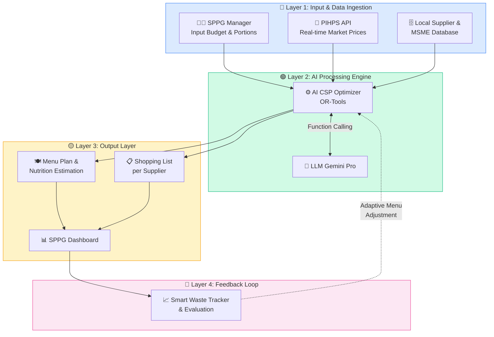

# 🏗️ Analisis Diagram Arsitektur — Nutrimize

---

## 📐 Diagram 1: System Architecture


### Arsitektur 4 Layer yang Teridentifikasi:



### Detail Per Layer:

#### 🔵 Layer 1 — Input & Data Ingestion

| Source | Tipe | Data | Catatan Implementasi |
|--------|------|------|---------------------|
| **SPPG Manager** | User Input (Frontend) | Budget per porsi (Rp 10K–15K), jumlah porsi, wilayah | Form di halaman Kalkulator Menu AI |
| **PIHPS API** | External API (Real-time) | Harga pangan harian per komoditas per wilayah | Perlu scraping/API call, cache di Redis (TTL: 24 jam) |
| **Local Supplier & MSME DB** | Internal Database | Daftar supplier, produk, harga, lokasi (lat/long), kapasitas | PostgreSQL, perlu data seeding awal |

> [!NOTE]
> **Insight Baru dari Diagram:** Ketiga data source mengalir langsung ke CSP Optimizer — artinya OR-Tools harus bisa mengonsumsi ketiga input ini secara simultan dalam satu optimization pass.

#### 🟢 Layer 2 — AI Processing Engine

| Component | Teknologi | Fungsi | Interaksi |
|-----------|-----------|--------|-----------|
| **AI CSP Optimizer** | Google OR-Tools (Python) | Kalkulasi kombinasi menu optimal dengan constraint: gizi, anggaran, ketersediaan bahan lokal | Menerima input dari 3 source, output → Menu Plan + Shopping List |
| **LLM Gemini Pro** | Google Gemini API | Dynamic substitution (saat inflasi), natural language generation untuk resep & panduan | **Berkomunikasi via Function Calling** dengan CSP Optimizer |

> [!IMPORTANT]
> **Key Architecture Decision:** Hubungan antara OR-Tools dan Gemini Pro adalah **bi-directional via Function Calling**. Ini berarti:
> 1. CSP Optimizer menyelesaikan optimasi matematis terlebih dahulu
> 2. Jika ada constraint yang tidak terpenuhi (harga naik, bahan kosong), Gemini dipanggil untuk melakukan substitusi cerdas
> 3. Hasil substitusi Gemini bisa memicu re-optimization di OR-Tools
> 4. Gemini juga menerjemahkan output teknis menjadi panduan bahasa natural

**Implementasi Function Calling Pattern:**
```python
# Pseudocode arsitektur
async def optimize_menu(budget, portions, region):
    # 1. Fetch real-time prices
    prices = await fetch_pihps_prices(region)
    
    # 2. Run CSP optimization
    result = csp_solver.solve(budget, portions, prices, nutrition_constraints)
    
    # 3. If infeasible or price spike detected
    if result.status == "INFEASIBLE" or detect_price_spike(prices):
        # Gemini function calling for substitution
        substitution = await gemini.function_call(
            tool="suggest_substitution",
            context={"failed_items": result.failed_constraints, "local_alternatives": get_local_foods(region)}
        )
        # Re-optimize with substituted ingredients
        result = csp_solver.solve(budget, portions, prices, nutrition_constraints, substitutions=substitution)
    
    # 4. Generate natural language output
    recipe_guide = await gemini.generate(f"Buat panduan resep untuk: {result.menu}")
    
    return {
        "menu": result.menu,
        "nutrition": result.nutrition_breakdown,
        "shopping_list": result.shopping_list_per_supplier,
        "recipe_guide": recipe_guide
    }
```

#### 🟡 Layer 3 — Output Layer

| Output | Ditampilkan Di | Data |
|--------|---------------|------|
| **Menu Plan & Nutrition Estimation** | Dashboard + Kalkulator AI | Nama menu, komposisi bahan + takaran, breakdown kalori/protein/karbo |
| **Shopping List per Supplier** | Dashboard + Marketplace | Daftar belanja yang sudah di-group per supplier lokal, dengan kuantitas dan harga estimasi |
| **SPPG Dashboard** | Halaman Dasbor Utama | Agregasi semua output: KPI, menu hari ini, status logistik |

> [!TIP]
> **Insight dari Diagram:** Output "Shopping List per Supplier" langsung terhubung ke halaman Marketplace — ini mengkonfirmasi user flow dari Kalkulator → Marketplace yang sudah kita identifikasi di mockup.

#### 🔴 Layer 4 — Feedback Loop

| Component | Data Flow | Efek |
|-----------|-----------|------|
| **Smart Waste Tracker & Evaluation** | Menerima data dari dashboard (output harian) | **Dashed line** kembali ke AI Processing Engine — "Adaptive Menu Adjustment" |

> [!IMPORTANT]
> **Adaptive Menu Adjustment** (dashed line) adalah fitur yang membedakan Nutrimize dari sistem lain:
> - Data waste harian menjadi **soft constraint** tambahan di CSP Optimizer
> - Item yang sering dibuang (misal: Tumis Kangkung 35% waste) akan mendapat penalty score
> - Seiring waktu, sistem otomatis menghindari merekomendasikan menu yang tidak disukai

---

## 📊 Diagram 2: Business Model Canvas


> Diagram ini sudah tercakup dalam analisis proposal sebelumnya. Berikut ringkasan poin yang **belum** tercakup:

### Tambahan dari BMC Diagram:

| Block | Detail Baru yang Ditemukan |
|-------|---------------------------|
| **Revenue Streams** | Premium ~$10/mo (≈ Rp 150.000) — lebih jelas angkanya |
| **Key Activities** | "Security Audits" — menandakan keamanan data government-grade penting |
| **Channels** | Distribusi via 3 kanal: Web Dashboard, WhatsApp Business Bot, Government-led socialization (BGN) |
| **Customer Relationships** | "AI Copilot Assistant (Self-service)" — mengarah ke chatbot/assistant di dashboard |

---

## 🔗 Mapping Arsitektur → Implementasi Teknis

Berdasarkan gabungan analisis (Proposal + Mockup + Arsitektur), berikut pemetaan lengkap:

### Backend API Routes

```
FastAPI Backend Structure:
├── /api/v1/
│   ├── /menu/
│   │   ├── POST /optimize          → Trigger CSP + Gemini optimization
│   │   ├── GET  /today             → Get today's menu for a SPPG
│   │   ├── POST /accept-substitution → Accept Gemini's substitution
│   │   └── GET  /history           → Menu history
│   │
│   ├── /prices/
│   │   ├── GET  /current/{region}  → Get PIHPS prices (cached)
│   │   └── GET  /trends/{commodity}→ Price trend data
│   │
│   ├── /suppliers/
│   │   ├── GET  /nearby            → Suppliers within radius (lat, long, km)
│   │   ├── GET  /{id}              → Supplier detail
│   │   └── POST /purchase-order    → Generate & send PO via WhatsApp
│   │
│   ├── /waste/
│   │   ├── POST /log               → Log daily waste per menu item
│   │   ├── GET  /trends            → Weekly/monthly waste trends
│   │   ├── GET  /recommendation    → AI adaptive recommendation
│   │   └── POST /apply-recommendation → Apply to next optimization
│   │
│   └── /dashboard/
│       ├── GET  /kpi               → Aggregated KPI data
│       └── GET  /system-status     → API health checks (PIHPS, BGN, WA)
```

### Database Schema (Draft)

```sql
-- Core Tables
┌─────────────────┐     ┌──────────────────┐     ┌─────────────────┐
│   sppg_kitchens  │     │   food_items      │     │   suppliers      │
├─────────────────┤     ├──────────────────┤     ├─────────────────┤
│ id (PK)         │     │ id (PK)          │     │ id (PK)         │
│ name            │     │ name             │     │ name            │
│ region          │     │ category         │     │ type (Gapoktan/ │
│ province        │     │ calories_per_100g│     │   UMKM/Nelayan) │
│ city            │     │ protein_per_100g │     │ region          │
│ lat, lng        │     │ carbs_per_100g   │     │ lat, lng        │
│ daily_budget    │     │ fat_per_100g     │     │ products        │
│ daily_portions  │     │ is_local_variant │     │ phone (WA)      │
│ status          │     │ region_available │     │ verified        │
└─────────────────┘     └──────────────────┘     └─────────────────┘

┌──────────────────┐     ┌──────────────────┐     ┌─────────────────┐
│   daily_menus     │     │   menu_items      │     │   market_prices  │
├──────────────────┤     ├──────────────────┤     ├─────────────────┤
│ id (PK)          │     │ id (PK)          │     │ id (PK)         │
│ kitchen_id (FK)  │     │ menu_id (FK)     │     │ food_item_id FK │
│ date             │     │ food_item_id FK  │     │ region          │
│ total_calories   │     │ quantity_grams   │     │ price_per_kg    │
│ total_protein    │     │ cost             │     │ date            │
│ total_cost       │     └──────────────────┘     │ source (PIHPS)  │
│ cost_per_portion │                               └─────────────────┘
│ ai_optimized     │
│ gemini_substituted│    ┌──────────────────┐
│ status           │     │   waste_logs      │
└──────────────────┘     ├──────────────────┤
                         │ id (PK)          │
                         │ menu_id (FK)     │
                         │ food_item_id FK  │
                         │ waste_percentage │
                         │ date             │
                         │ notes            │
                         └──────────────────┘
```

---

## ✅ Kesimpulan Gabungan (Proposal + Mockup + Arsitektur)

Setelah menganalisis **3 artefak** (PDF Proposal, 4 Mockup Screens, 2 Diagram Arsitektur), saya punya gambaran lengkap tentang Nutrimize. Berikut status pemahaman saya:

| Aspek | Status | Catatan |
|-------|--------|---------|
| Problem Statement | ✅ Sangat jelas | Trilemma operasional SPPG |
| Solusi & Value Proposition | ✅ Jelas | 3 modul AI (Optimizer, Supplier, Waste) |
| UI/UX Design | ✅ Jelas | 4 halaman mockup dengan HTML code |
| System Architecture | ✅ Jelas | 4 layer, data flow, function calling pattern |
| Tech Stack | ✅ Jelas | Next.js + FastAPI + PostgreSQL + OR-Tools + Gemini |
| Business Model | ✅ Jelas | Freemium + B2B commission + data licensing |
| Data Sources | ⚠️ Perlu klarifikasi | PIHPS API access, food nutrition DB seed |
| Timeline | ❓ Belum diketahui | Berapa sisa waktu hackathon? |
| Auth/Login | ❓ Belum diketahui | Perlu untuk MVP? |

---

## ❓ Final Clarification (Consolidated)

Dari seluruh analisis, hanya ini yang masih perlu dijawab sebelum eksekusi:

| # | Pertanyaan | Default |
|---|-----------|---------|
| 1 | **⏰ Sisa waktu hackathon?** | 2-3 hari |
| 2 | **🔐 Login/Auth di MVP?** | Skip, langsung dashboard |
| 3 | **🗺️ Google Maps atau Leaflet?** | Leaflet (gratis) |
| 4 | **📱 Mobile responsive?** | Desktop-first |
| 5 | **📍 Data demo 1 kota?** | Ya, Banyuwangi |
| 6 | **🌾 Sudah ada dataset nutrisi bahan pangan?** | Saya buatkan seed data |

> [!IMPORTANT]
> Jawab pertanyaan di atas, atau katakan **"Langsung mulai"** dan saya akan pakai default assumptions lalu langsung setup project! 🚀
