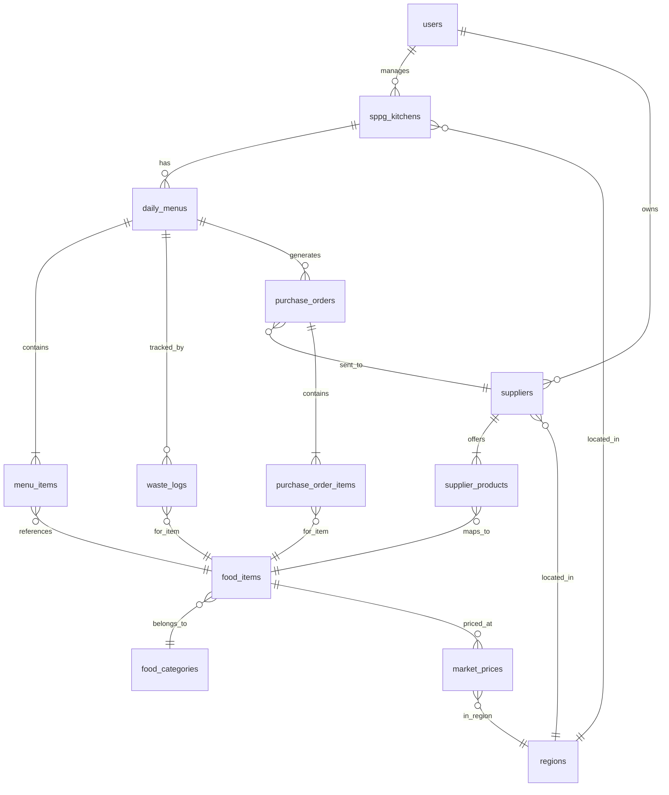

# 🗄️ Database Schema Design — Nutrimize

## Auth & User Roles

Berdasarkan analisis, ada **3 role** yang perlu:

| Role | User | Akses |
|------|------|-------|
| `KITCHEN_MANAGER` | Pengelola Dapur SPPG | Menu AI, Marketplace, Waste, Dashboard sendiri |
| `SUPPLIER` | Petani/UMKM *(fase 2, pasif dulu)* | Kelola produk, terima PO |
| `GOVERNMENT_ADMIN` | BGN/Kemenkes | Dashboard agregat nasional |

> MVP fokus: **KITCHEN_MANAGER** + **GOVERNMENT_ADMIN**

---

## ERD (Entity Relationship Diagram)



---

## Table Definitions

### 1. `users`
```sql
CREATE TABLE users (
    id              UUID PRIMARY KEY DEFAULT gen_random_uuid(),
    email           VARCHAR(255) UNIQUE NOT NULL,
    password_hash   VARCHAR(255) NOT NULL,
    full_name       VARCHAR(255) NOT NULL,
    role            VARCHAR(50) NOT NULL CHECK (role IN ('KITCHEN_MANAGER', 'SUPPLIER', 'GOVERNMENT_ADMIN')),
    phone           VARCHAR(20),
    avatar_url      TEXT,
    is_active       BOOLEAN DEFAULT true,
    created_at      TIMESTAMPTZ DEFAULT NOW(),
    updated_at      TIMESTAMPTZ DEFAULT NOW()
);
```

### 2. `regions`
```sql
CREATE TABLE regions (
    id              SERIAL PRIMARY KEY,
    province        VARCHAR(100) NOT NULL,
    city            VARCHAR(100) NOT NULL,
    district        VARCHAR(100),            -- Kecamatan (for supplier matching)
    pihps_code      VARCHAR(20),             -- Kode wilayah PIHPS API
    lat             DECIMAL(10, 7),
    lng             DECIMAL(10, 7),
    UNIQUE(province, city, district)
);
```

### 3. `sppg_kitchens`
```sql
CREATE TABLE sppg_kitchens (
    id              UUID PRIMARY KEY DEFAULT gen_random_uuid(),
    user_id         UUID NOT NULL REFERENCES users(id) ON DELETE CASCADE,
    name            VARCHAR(255) NOT NULL,     -- e.g. "Dapur SPPG Banyuwangi"
    region_id       INT NOT NULL REFERENCES regions(id),
    address         TEXT,
    lat             DECIMAL(10, 7),
    lng             DECIMAL(10, 7),
    daily_budget    INT NOT NULL DEFAULT 10000, -- Rp per porsi (10000-15000)
    daily_portions  INT NOT NULL DEFAULT 250,
    status          VARCHAR(20) DEFAULT 'OPERATIONAL',
    created_at      TIMESTAMPTZ DEFAULT NOW(),
    updated_at      TIMESTAMPTZ DEFAULT NOW()
);
```

### 4. `food_categories`
```sql
CREATE TABLE food_categories (
    id              SERIAL PRIMARY KEY,
    name            VARCHAR(100) NOT NULL UNIQUE,  -- Karbohidrat, Protein Hewani, Protein Nabati, Sayuran, Buah
    description     TEXT
);
```

### 5. `food_items` ⭐ (Master Data Gizi)
```sql
CREATE TABLE food_items (
    id              SERIAL PRIMARY KEY,
    name            VARCHAR(255) NOT NULL,
    category_id     INT REFERENCES food_categories(id),
    calories        DECIMAL(8, 2) NOT NULL,    -- per 100g
    protein         DECIMAL(8, 2) NOT NULL,    -- per 100g (gram)
    carbohydrates   DECIMAL(8, 2) NOT NULL,    -- per 100g (gram)
    fat             DECIMAL(8, 2) NOT NULL,    -- per 100g (gram)
    fiber           DECIMAL(8, 2) DEFAULT 0,   -- per 100g (gram)
    unit            VARCHAR(20) DEFAULT 'gram', -- gram, pcs, ml
    is_local        BOOLEAN DEFAULT false,
    local_regions   TEXT[],                     -- Array of region names where locally available
    description     TEXT,
    created_at      TIMESTAMPTZ DEFAULT NOW()
);

CREATE INDEX idx_food_items_category ON food_items(category_id);
```

### 6. `suppliers`
```sql
CREATE TABLE suppliers (
    id              UUID PRIMARY KEY DEFAULT gen_random_uuid(),
    user_id         UUID REFERENCES users(id),  -- NULL if not registered as user yet
    name            VARCHAR(255) NOT NULL,
    type            VARCHAR(50) NOT NULL CHECK (type IN ('GAPOKTAN', 'UMKM', 'NELAYAN', 'PETERNAK', 'OTHER')),
    region_id       INT NOT NULL REFERENCES regions(id),
    address         TEXT,
    lat             DECIMAL(10, 7),
    lng             DECIMAL(10, 7),
    phone           VARCHAR(20),                -- WhatsApp number
    description     TEXT,
    is_verified     BOOLEAN DEFAULT false,
    created_at      TIMESTAMPTZ DEFAULT NOW(),
    updated_at      TIMESTAMPTZ DEFAULT NOW()
);

CREATE INDEX idx_suppliers_region ON suppliers(region_id);
CREATE INDEX idx_suppliers_type ON suppliers(type);
```

### 7. `supplier_products`
```sql
CREATE TABLE supplier_products (
    id              SERIAL PRIMARY KEY,
    supplier_id     UUID NOT NULL REFERENCES suppliers(id) ON DELETE CASCADE,
    food_item_id    INT NOT NULL REFERENCES food_items(id),
    price_per_kg    INT NOT NULL,               -- Rp per kg
    stock_kg        DECIMAL(10, 2),             -- Available stock in kg
    is_available    BOOLEAN DEFAULT true,
    updated_at      TIMESTAMPTZ DEFAULT NOW(),
    UNIQUE(supplier_id, food_item_id)
);
```

### 8. `market_prices` (PIHPS Cache)
```sql
CREATE TABLE market_prices (
    id              SERIAL PRIMARY KEY,
    food_item_id    INT NOT NULL REFERENCES food_items(id),
    region_id       INT NOT NULL REFERENCES regions(id),
    price_per_kg    INT NOT NULL,               -- Rp
    price_date      DATE NOT NULL,
    source          VARCHAR(50) DEFAULT 'PIHPS',
    created_at      TIMESTAMPTZ DEFAULT NOW(),
    UNIQUE(food_item_id, region_id, price_date)
);

CREATE INDEX idx_market_prices_date ON market_prices(price_date DESC);
CREATE INDEX idx_market_prices_region_date ON market_prices(region_id, price_date DESC);
```

### 9. `daily_menus` ⭐ (Output AI)
```sql
CREATE TABLE daily_menus (
    id              UUID PRIMARY KEY DEFAULT gen_random_uuid(),
    kitchen_id      UUID NOT NULL REFERENCES sppg_kitchens(id),
    menu_date       DATE NOT NULL,
    meal_type       VARCHAR(20) DEFAULT 'LUNCH',  -- LUNCH, BREAKFAST, SNACK
    package_name    VARCHAR(100),                  -- "Paket Nutrisi A"
    main_dish       VARCHAR(255),                  -- "Ayam Woku Kemangi"
    
    -- Nutrition totals (per porsi)
    total_calories  DECIMAL(8, 2),
    total_protein   DECIMAL(8, 2),
    total_carbs     DECIMAL(8, 2),
    total_fat       DECIMAL(8, 2),
    
    -- Cost
    cost_per_portion INT,
    total_cost       INT,                          -- cost_per_portion * portions
    portions         INT,
    
    -- AI metadata
    is_ai_optimized     BOOLEAN DEFAULT false,
    is_substituted      BOOLEAN DEFAULT false,
    substitution_reason TEXT,                       -- "Harga daging ayam naik 25%"
    optimization_time_ms INT,                       -- Processing time
    recipe_guide        TEXT,                       -- Gemini-generated recipe in natural language
    
    status          VARCHAR(20) DEFAULT 'DRAFT' CHECK (status IN ('DRAFT', 'CONFIRMED', 'SERVED', 'EVALUATED')),
    schedule_time   TIME DEFAULT '12:00',
    created_at      TIMESTAMPTZ DEFAULT NOW(),
    updated_at      TIMESTAMPTZ DEFAULT NOW(),
    UNIQUE(kitchen_id, menu_date, meal_type)
);

CREATE INDEX idx_daily_menus_kitchen_date ON daily_menus(kitchen_id, menu_date DESC);
```

### 10. `menu_items` (Komposisi Bahan per Menu)
```sql
CREATE TABLE menu_items (
    id              SERIAL PRIMARY KEY,
    menu_id         UUID NOT NULL REFERENCES daily_menus(id) ON DELETE CASCADE,
    food_item_id    INT NOT NULL REFERENCES food_items(id),
    quantity_grams  DECIMAL(8, 2) NOT NULL,       -- Takaran per porsi
    cost            INT,                           -- Biaya per porsi untuk item ini
    display_order   INT DEFAULT 0,
    UNIQUE(menu_id, food_item_id)
);
```

### 11. `waste_logs` ⭐ (Feedback Loop)
```sql
CREATE TABLE waste_logs (
    id              SERIAL PRIMARY KEY,
    menu_id         UUID NOT NULL REFERENCES daily_menus(id),
    food_item_id    INT NOT NULL REFERENCES food_items(id),
    waste_percentage DECIMAL(5, 2) NOT NULL CHECK (waste_percentage >= 0 AND waste_percentage <= 100),
    log_date        DATE NOT NULL,
    notes           TEXT,
    created_at      TIMESTAMPTZ DEFAULT NOW(),
    UNIQUE(menu_id, food_item_id)
);

CREATE INDEX idx_waste_logs_date ON waste_logs(log_date DESC);
```

### 12. `purchase_orders`
```sql
CREATE TABLE purchase_orders (
    id              UUID PRIMARY KEY DEFAULT gen_random_uuid(),
    menu_id         UUID REFERENCES daily_menus(id),
    kitchen_id      UUID NOT NULL REFERENCES sppg_kitchens(id),
    supplier_id     UUID NOT NULL REFERENCES suppliers(id),
    order_date      DATE NOT NULL,
    total_amount    INT,                           -- Total Rp
    status          VARCHAR(20) DEFAULT 'PENDING' CHECK (status IN ('PENDING', 'SENT', 'CONFIRMED', 'DELIVERED', 'CANCELLED')),
    sent_via        VARCHAR(20) DEFAULT 'WHATSAPP',
    created_at      TIMESTAMPTZ DEFAULT NOW(),
    updated_at      TIMESTAMPTZ DEFAULT NOW()
);
```

### 13. `purchase_order_items`
```sql
CREATE TABLE purchase_order_items (
    id              SERIAL PRIMARY KEY,
    order_id        UUID NOT NULL REFERENCES purchase_orders(id) ON DELETE CASCADE,
    food_item_id    INT NOT NULL REFERENCES food_items(id),
    quantity_kg     DECIMAL(10, 2) NOT NULL,
    price_per_kg    INT NOT NULL,
    subtotal        INT NOT NULL
);
```

---

## Indexes & Performance

```sql
-- Key composite indexes for frequent queries
CREATE INDEX idx_food_items_local ON food_items(is_local) WHERE is_local = true;
CREATE INDEX idx_suppliers_verified ON suppliers(is_verified) WHERE is_verified = true;
CREATE INDEX idx_daily_menus_status ON daily_menus(status);
CREATE INDEX idx_purchase_orders_status ON purchase_orders(status);

-- Geospatial (if PostGIS enabled, otherwise handled in app layer)
-- CREATE INDEX idx_suppliers_location ON suppliers USING GIST(ST_MakePoint(lng, lat));
-- CREATE INDEX idx_kitchens_location ON sppg_kitchens USING GIST(ST_MakePoint(lng, lat));
```

---

## Seed Data Strategy (Banyuwangi Demo)

| Table | Seed Data | Source |
|-------|-----------|--------|
| `regions` | 1 province (Jawa Timur), 1 city (Banyuwangi), 5 districts | Manual |
| `food_categories` | 5 kategori: Karbohidrat, Protein Hewani, Protein Nabati, Sayuran, Buah | Manual |
| `food_items` | ~30-40 bahan pangan umum + lokal Banyuwangi dengan data gizi (AKG) | Data Kemenkes |
| `suppliers` | 5-8 supplier demo (Gapoktan, Nelayan, UMKM) | Mock data |
| `supplier_products` | 2-4 produk per supplier | Mock data |
| `market_prices` | 7 hari data harga untuk ~15 komoditas | PIHPS reference |
| `users` | 3 demo accounts (1 kitchen manager, 1 supplier, 1 gov admin) | Manual |
| `sppg_kitchens` | 1 dapur: "Dapur SPPG Banyuwangi" | Manual |

---

## Key Relationships Summary

```
User ──→ Kitchen (1:N) ──→ DailyMenu (1:N) ──→ MenuItems (1:N) ──→ FoodItem
                                │                                        ↑
                                ├──→ WasteLogs (1:N) ────────────────────┘
                                │                                        ↑
                                └──→ PurchaseOrders (1:N) ──→ POItems ───┘
                                          │
                                          ↓
                                     Supplier ──→ SupplierProducts ──→ FoodItem
                                          │
                                          ↓
                                       Region ←── MarketPrices ──→ FoodItem
```

> [!IMPORTANT]  
> **Keputusan yang perlu Anda validasi:**
> 1. Apakah **meal_type** perlu support multi (LUNCH, BREAKFAST, SNACK) atau cukup Makan Siang saja untuk MVP?
> 2. Apakah perlu tabel `nutrition_standards` terpisah untuk menyimpan constraint AKG (800-900 kkal, 15g protein, dll), atau cukup hardcode di backend?
> 3. ORM preference — **SQLAlchemy** (Python/FastAPI native) atau **Prisma** (yang Anda sudah familiar)?
