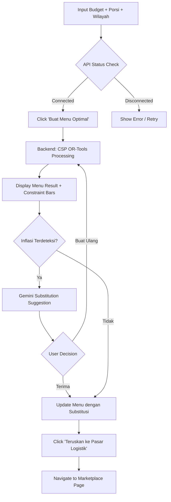
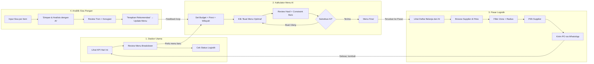

# 🎨 Analisis Mockup UI/UX — Nutrimize

Berikut adalah analisis mendalam dari 4 mockup screen yang disediakan, mencakup design system, UX flow, component mapping, dan rekomendasi implementasi.

---

## 📑 Overview: 4 Halaman Utama

````carousel
### Screen 1: Dasbor Utama (Main Dashboard)


Halaman utama pengelola SPPG — menampilkan KPI ringkasan, menu hari ini, status logistik, dan integrasi sistem BGN.
<!-- slide -->
### Screen 2: Kalkulator Menu AI (OR-Tools)


Halaman core AI — input parameter optimasi (anggaran, porsi, wilayah) dan output menu optimal dengan substitusi Gemini.
<!-- slide -->
### Screen 3: Pasar Logistik & B2B Matchmaking


Halaman marketplace — peta pemasok lokal dengan radius, katalog mitra, dan Purchase Order via WhatsApp.
<!-- slide -->
### Screen 4: Analitik Sisa Pangan (Food Waste)


Halaman waste tracking — input sisa harian, tren mingguan, estimasi kerugian, dan rekomendasi AI adaptif.
````

---

## 1. 🏠 Screen: Dasbor Utama

### Komponen yang Teridentifikasi

| # | Komponen | Deskripsi | Data yang Ditampilkan |
|---|----------|-----------|----------------------|
| 1 | **KPI Cards (4x)** | Stat cards horizontal | Biaya/Porsi (Rp 9.850), Total Porsi (250), Target Gizi (850 kkal, 18g protein, 100%), Sisa Pangan (12%) |
| 2 | **Menu Breakdown Card** | Card besar dengan badge "AI Optimized" | Nama paket (Paket Nutrisi A), menu utama, target kalori (850 kkal), jadwal (12:00 WIB), komposisi bahan (4 item dengan emoji + takaran) |
| 3 | **Action Buttons** | Footer card menu | "Unduh Resep" (PDF), "Edit Menu", "Validasi Porsi" |
| 4 | **Pasokan Logistik Esok Hari** | Side widget daftar pemasok | Item + supplier name + status badge ("Siap Dikirim") |
| 5 | **CTA Button** | Hijau penuh | "Hubungkan ke UMKM Lokal" |
| 6 | **Status Integrasi Sistem (BGN)** | Dark card premium | Status API (Harga: Online, Server Gizi: Online, WA Bot: Aktif), Performance: 98% |

### Analisis UX

> [!TIP]
> **Kekuatan Design:**
> - KPI cards memberikan **at-a-glance insight** yang sangat efektif
> - Badge "Sesuai Anggaran" dan circular progress (100%) membantu quick assessment
> - Dark card BGN memberikan kontras visual yang kuat — menunjukkan koneksi government grade
> - Emoji pada komposisi bahan membuat data teknis lebih approachable

> [!NOTE]
> **Catatan Implementasi:**
> - Perlu data real-time dari backend: biaya/porsi (dari CSP result), target gizi (dari AKG), sisa pangan (dari waste tracker)
> - "Validasi Porsi" butuh flow konfirmasi — apakah ini finalisasi menu untuk esok hari?
> - Status integrasi BGN perlu health-check endpoint ke API PIHPS dan server gizi

---

## 2. ✨ Screen: Kalkulator Menu AI (OR-Tools)

### Komponen yang Teridentifikasi

| # | Komponen | Deskripsi | Data/Interaksi |
|---|----------|-----------|----------------|
| 1 | **Form Input: Pengaturan Optimasi** | Left panel | Budget slider (Rp 10.000), Jumlah Porsi (250), Konteks Wilayah dropdown (Banyuwangi, Jawa Timur) |
| 2 | **API Status Indicators** | Badge hijau | "PIHPS PRICE API: TERHUBUNG", "NUTRITION DB: TERHUBUNG" |
| 3 | **CTA Button** | Full-width hijau | "✨ Buat Menu Optimal" |
| 4 | **Menu Result Card** | Right panel | Badge "OPTIMASI BERHASIL", numbered items (1. Nasi Putih, 2. Ikan Tongkol, 3. Tempe Goreng, 4. Sayur Bayam) |
| 5 | **Progress Bars (3x)** | Visualisasi constraint | BIAYA: Rp 9.800 / Rp 10Rb, KALORI: 820/850 kkal, PROTEIN: 17G / TARGET 15G |
| 6 | **AI Substitution Card** | Hijau muda box | Insight Gemini: "Harga daging ayam naik 25%... AI otomatis mengganti ayam dengan Ikan Tongkol lokal..." + "Terima Substitusi AI" / "Buat Ulang" buttons |
| 7 | **Forward CTA** | Hijau teal penuh | "Teruskan Kebutuhan Bahan ke Pasar Logistik →" |

### Analisis UX

> [!IMPORTANT]
> **Ini adalah halaman PALING KRITIS — jantung dari Nutrimize.**

**User Flow yang teridentifikasi:**


> [!NOTE]
> **Key Technical Requirements:**
> - **Budget slider** range: Rp 10.000 — Rp 15.000 (sesuai constraint program MBG)
> - **Wilayah dropdown** harus sesuai coverage API PIHPS (34 provinsi, level kabupaten/kota)
> - **Progress bars** harus update secara reaktif setelah optimization
> - **Substitution card** muncul kondisional — hanya ketika ada inflasi/ketersediaan issue
> - Flow yang seamless dari Kalkulator → Pasar Logistik (state harus dibawa)

---

## 3. 🗺️ Screen: Pasar Logistik & B2B Matchmaking

### Komponen yang Teridentifikasi

| # | Komponen | Deskripsi | Data/Interaksi |
|---|----------|-----------|----------------|
| 1 | **Peta Interaktif (Map)** | Left panel besar | Google Maps embed, marker: Dapur SPPG (hijau besar), supplier markers, radius circle (5km/10km toggle) |
| 2 | **Radius Toggle** | Radio buttons | 5km / 10km |
| 3 | **Daftar Belanja Gizi (dari AI)** | Top-right cards | Daging Ayam 12kg, Sayur Bayam 8kg, Ikan Tongkol 10kg — dengan ikon/emoji |
| 4 | **Filter Katalog** | Dropdown filters | Zona: Banyuwangi, Radius: <10km |
| 5 | **Katalog Mitra Pangan Cerdas** | Card list | Per supplier: Nama (Gapoktan Sayur Licin), badge "Pencocokan Menu AI", deskripsi produk, Harga Estimasi (Rp 15.000/kg), badge "Bawah Pasar", button "Chat" |
| 6 | **API Status** | Green dot | "PIHPS API Price Check: Active" |
| 7 | **CTA Bottom** | Full-width teal | "Konfirmasi & Kirim Purchase Order ke UMKM (via WhatsApp Bot)" |

### Analisis UX

> [!TIP]
> **Brilliant Design Decisions:**
> - **"Pencocokan Menu AI"** badge pada supplier — langsung menunjukkan relevansi supplier dengan menu yang baru dioptimasi
> - **"Bawah Pasar"** price badge — memberikan confidence bahwa harga lebih murah dari pasar umum
> - **Radius-based filtering** — hyper-local approach sesuai dengan value proposition
> - **WhatsApp PO** — leverages existing communication channel, tidak perlu onboarding pemasok ke platform baru

> [!WARNING]
> **Technical Challenges:**
> - **Google Maps integration** memerlukan API key (biaya jika volume tinggi)
> - **Supplier database** — dari mana data awal supplier? Perlu onboarding/seeding mechanism
> - **WhatsApp Business API** — perlu business verification dan template message approval
> - **Real-time price comparison** — "Bawah Pasar" badge butuh benchmarking dari PIHPS

---

## 4. 📊 Screen: Analitik Sisa Pangan (Food Waste)

### Komponen yang Teridentifikasi

| # | Komponen | Deskripsi | Data/Interaksi |
|---|----------|-----------|----------------|
| 1 | **Form Input: Sisa Pangan Hari Ini** | Left card | Dropdown pilih menu (Makan Siang - Paket Nutrisi A), per-item slider: Nasi Putih (5%), Ayam Woku (12%), Tumis Kangkung (35% — highlighted merah) |
| 2 | **CTA Input** | Hijau penuh | "✨ Simpan & Analisis dengan AI" |
| 3 | **Chart: Tren Sisa Pangan Harian** | Line chart | 7 hari terakhir (Sen-Min), rata-rata 14%, legend "% Sisa" |
| 4 | **KPI: Rata-rata Sisa Mingguan** | Stat card | 12%, trend ↘ 2% (positif, turun) |
| 5 | **KPI: Estimasi Kerugian Negara** | Stat card merah | Rp 125.000, trend ↗ 5% (negatif, naik) |
| 6 | **Rekomendasi AI Adaptif** | Bottom card hijau muda | Insight: "35% sisa pada Tumis Kangkung → Ganti dengan Sayur Bayam", CTA: "Terapkan Rekomendasi" |

### Analisis UX

> [!NOTE]
> **Feedback Loop Design:**
> Input sisa → AI analisis → Rekomendasi substitusi → Terapkan ke menu minggu depan
> 
> Ini adalah **adaptive learning loop** yang membuat sistem semakin pintar seiring waktu.

> [!TIP]
> **Design Highlights:**
> - Slider per-item sangat intuitif untuk input cepat oleh pengelola dapur
> - Item dengan waste tinggi (Tumis Kangkung 35%) di-highlight merah — instant visual alert
> - "Estimasi Kerugian Negara" memberikan urgency dan konteks dampak finansial
> - Rekomendasi AI langsung actionable ("Terapkan Rekomendasi")

---

## 5. 🎨 Design System yang Teridentifikasi

### Color Palette

| Token | Value | Usage |
|-------|-------|-------|
| `brandGreen` / `nutritionGreen` | `#10B981` (Emerald 500) | Primary CTA, branding, badges, progress indicators |
| `govBlue` | `#2F80ED` | Avatar, secondary accents |
| `govDarkBlue` | `#334155` (Slate 700) | Headers, dark card bg |
| Background | `#F9FAFB` (Gray 50) | Page background |
| Card BG | `#FFFFFF` | Card surfaces |
| Text Primary | Slate 900 | Headlines, values |
| Text Secondary | Slate 500 | Labels, descriptions |
| Alert/Warning | Red/Orange tones | Waste highlight, price increase |

### Typography
| Element | Font | Weight | Size |
|---------|------|--------|------|
| Brand Logo | Inter | Bold | 24px |
| Page Title | Inter | Bold | 18-20px |
| Card Title | Inter | Bold | 14-16px |
| KPI Value | Inter | Bold | 24-30px |
| Body | Inter | Medium | 14px |
| Label/Caption | Inter | Bold/Medium | 10-12px, uppercase, tracking-widest |

### Component Patterns
| Pattern | Description |
|---------|-------------|
| **Cards** | `rounded-xl/2xl`, `border border-gray-200`, `shadow-sm`, `hover:shadow-md` |
| **Buttons Primary** | `bg-brandGreen text-white rounded-lg/xl`, `hover:bg-emerald-700` |
| **Buttons Secondary** | `bg-slate-100 text-slate-700 rounded-xl`, `hover:bg-slate-200` |
| **Badges** | `rounded-full`, `text-[10px] font-bold uppercase tracking-widest` |
| **Progress Bars** | Full-width colored bars with label left, value right |
| **Status Indicators** | Green dot (`bg-emerald-500`) + text label |
| **Sidebar** | Fixed left, `w-64`, white bg, active item: `bg-emerald-50 text-brandGreen` |

### Framework dari Mockup HTML
- **CSS Framework**: Tailwind CSS v3 (CDN)
- **Font**: Inter (Google Fonts)
- **Icons**: Material Symbols Outlined
- **Layout**: Flexbox + CSS Grid

---

## 6. 🔄 User Journey (End-to-End Flow)



---

## 7. 📋 Component Inventory untuk Development

### Reusable Components

| Component | Used In | Priority |
|-----------|---------|----------|
| `<Sidebar />` | All pages | 🔴 P0 |
| `<Header />` | All pages | 🔴 P0 |
| `<StatCard />` | Dashboard, Waste | 🔴 P0 |
| `<MenuBreakdownCard />` | Dashboard | 🟡 P1 |
| `<IngredientItem />` | Dashboard, Calculator | 🟡 P1 |
| `<ConstraintProgressBar />` | Calculator | 🟡 P1 |
| `<AIInsightCard />` | Calculator, Waste | 🟡 P1 |
| `<SupplierCard />` | Marketplace | 🟢 P2 |
| `<MapView />` | Marketplace | 🟢 P2 |
| `<WasteSliderInput />` | Waste Tracker | 🟢 P2 |
| `<TrendChart />` | Waste Tracker | 🟢 P2 |
| `<SystemStatusCard />` | Dashboard | 🟢 P2 |
| `<Badge />` | All pages | 🔴 P0 |
| `<Button />` | All pages | 🔴 P0 |

### Page Routes

| Route | Page | Sidebar Label |
|-------|------|---------------|
| `/` or `/dashboard` | Dasbor Utama | Dasbor Utama |
| `/calculator` | Kalkulator Menu AI | Kalkulator Menu AI |
| `/marketplace` | Pasar Logistik UMKM | Pasar Logistik UMKM |
| `/waste-analytics` | Analitik Sisa Pangan | Analitik Sisa Pangan |
| `/suppliers` | Katalog Petani Lokal | Button CTA sidebar |

---

## 8. ❓ Pertanyaan Klarifikasi (Updated)

Berdasarkan analisis mockup, berikut pertanyaan yang terupdate:

| # | Pertanyaan | Impact |
|---|-----------|--------|
| 1 | **Login/Auth flow** — Tidak ada mockup untuk halaman login. Apakah perlu diimplementasikan untuk MVP? | Menentukan apakah perlu auth system |
| 2 | **"Katalog Petani Lokal"** (tombol sidebar bawah) — Apakah ini halaman terpisah atau sama dengan Pasar Logistik? | Routing structure |
| 3 | **Responsive/Mobile** — Mockup hanya menunjukkan desktop. Apakah perlu mobile responsive untuk MVP? | Development effort |
| 4 | **Google Maps API** — Apakah sudah punya API key, atau bisa kita pakai alternatif gratis (Leaflet + OpenStreetMap)? | Cost & dependency |
| 5 | **Timeline hackathon** — Berapa hari/minggu yang tersisa? | Menentukan scope MVP final |
| 6 | **Data seed** — Untuk demo, apakah cukup dummy data Banyuwangi saja? | Scope data preparation |

---

## 9. ✅ Kesimpulan & Rekomendasi

> [!IMPORTANT]
> **Mockup sudah sangat matang dan well-thought-out.** Design system konsisten, UX flow logis, dan setiap halaman memiliki value proposition yang jelas. Ini bisa langsung ditranslasikan ke kode.

### Rekomendasi Langkah Selanjutnya:

| # | Langkah | Estimasi |
|---|---------|----------|
| 1 | **Project Setup** — Next.js + Tailwind + struktur folder | 30 menit |
| 2 | **Design System** — Implement color tokens, typography, reusable components (Sidebar, Header, Button, Badge, StatCard) | 2 jam |
| 3 | **Dashboard Page** — Implement halaman Dasbor Utama (static first) | 2 jam |
| 4 | **Calculator Page** — Form + API integration ke backend | 3 jam |
| 5 | **Backend Setup** — FastAPI + OR-Tools + Gemini integration | 4 jam |
| 6 | **Marketplace Page** — Map + supplier list | 3 jam |
| 7 | **Waste Analytics Page** — Input form + chart | 2 jam |

**Total estimasi MVP frontend: ~12 jam kerja**
**Total estimasi MVP full-stack: ~20 jam kerja**
