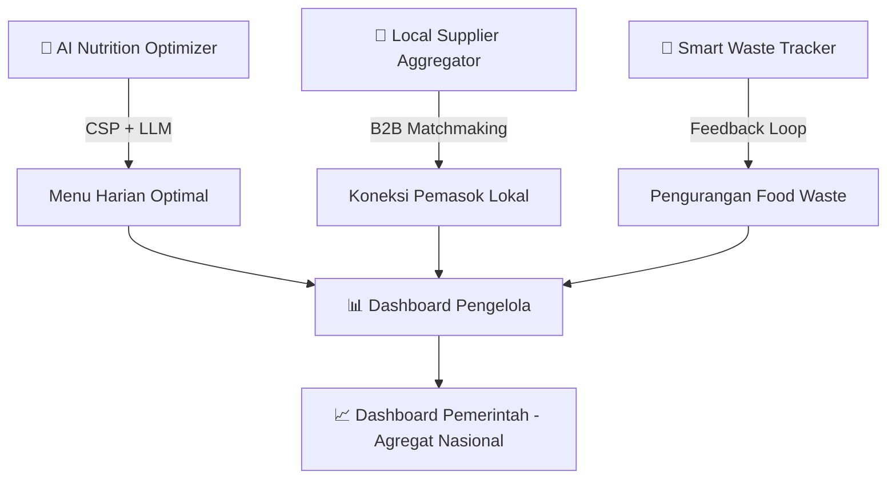
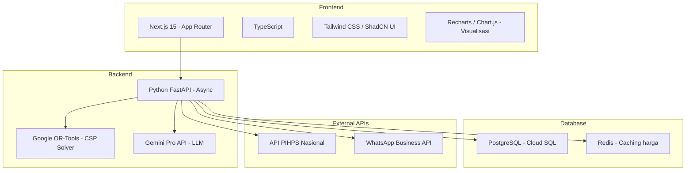
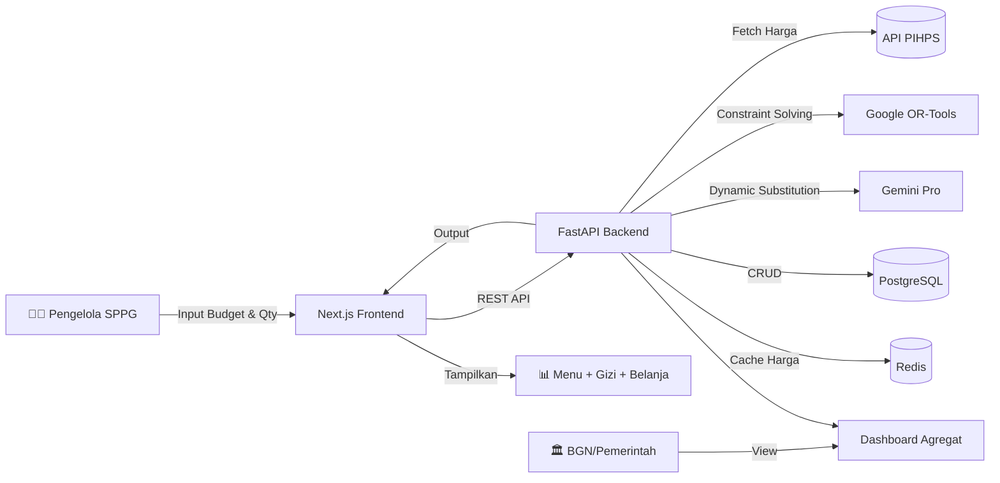
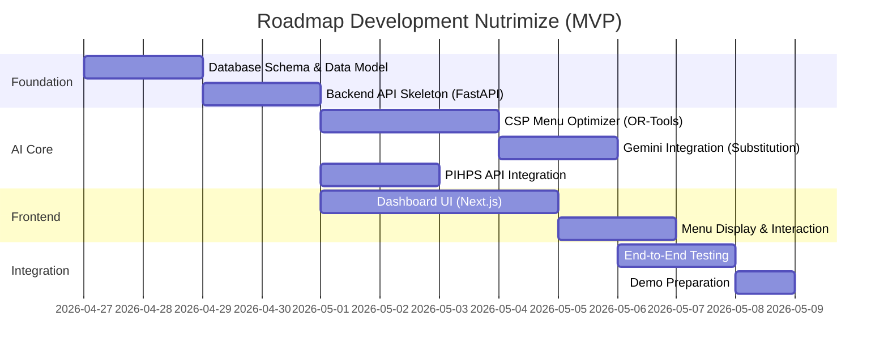

# 📋 Analisis Proposal: NUTRIMIZE
## Hackathon & Digdaya PIDI 2026 — Tim Nalarwangsa

---

## 1. 🔴 Problem Statement (Latar Belakang Masalah)

Pengelola **Satuan Pelayanan Pemenuhan Gizi (SPPG)** dalam Program **Makan Bergizi Gratis (MBG)** menghadapi **trilemma operasional harian**:

- **Standar gizi ketat** — Wajib memenuhi 800–900 kkal dengan minimal 15g protein per porsi (standar Badan Gizi Nasional).
- **Anggaran sangat terbatas** — Hanya Rp10.000–Rp15.000 per porsi.
- **Fluktuasi harga pangan** — Disparitas harga antardaerah mencapai 30–50%, mempersulit perencanaan.
- **Tidak ada Decision Support System** — Pengelola harus kalkulasi manual → kualitas gizi dikorbankan demi biaya, atau biaya membengkak akibat pemasok luar daerah.

### Dampak Fatal:
| # | Dampak | Skala |
|---|--------|-------|
| 1 | Ketimpangan gizi antarwilayah | 15–16,5 juta penerima manfaat (siswa, balita, ibu hamil) |
| 2 | Beban operasional pengelola | 5.000+ SPPG tanpa support system |
| 3 | UMKM & petani lokal terpinggirkan | Jutaan petani tersingkir, monopoli pemasok besar |
| 4 | Tidak ada monitoring real-time | BGN & Kemenkes tanpa data kepatuhan gizi nasional |

---

## 2. 💡 Proposed Solution (Solusi Utama)

**Nutrimize** = Platform web berbasis **AI Decision Support System** untuk pengelola SPPG.

### Arsitektur 3 Modul Utama:

### Alur Kerja (Input → Proses → Output):

| Tahap | Deskripsi |
|-------|-----------|
| **1. Input & Akuisisi Data** | Pengelola input anggaran + kuantitas. Sistem otomatis tarik data harga real-time dari API PIHPS + stok UMKM lokal tingkat kecamatan |
| **2. Pemrosesan AI** | CSP Optimizer kalkulasi menu optimal (800-900 kkal, 15g protein, karbohidrat 45-65%). Jika inflasi → LLM dynamic substitution bahan lokal termurah. Waste tracker sebagai soft constraint |
| **3. Output** | Instruksi resep detail, matriks pemenuhan gizi, Purchase Order (PO) langsung ke pemasok lokal terpilih |

---

## 3. 🎯 Core Features (MVP yang Harus Dibangun)

### Tier 1 — Must Have (MVP Hackathon)
| # | Fitur | Deskripsi |
|---|-------|-----------|
| 1 | **AI Menu Optimizer** | Algoritma CSP (Google OR-Tools) mengkalkulasi menu harian optimal dengan constraint gizi + anggaran |
| 2 | **Real-time Price Integration** | Integrasi API PIHPS untuk data harga pangan harian 34 provinsi |
| 3 | **Nutritional Calculator** | Kalkulasi gizi presisi berdasar standar AKG Kemenkes 2019 |
| 4 | **LLM Dynamic Substitution** | Gemini Pro untuk substitusi bahan saat harga naik + generate panduan bahasa natural |
| 5 | **Dashboard Pengelola** | Tampilkan menu, detail resep, matriks gizi, dan daftar belanja |

### Tier 2 — Should Have (Post-MVP)
| # | Fitur | Deskripsi |
|---|-------|-----------|
| 6 | **Local Supplier Aggregator** | B2B matchmaking pengelola ↔ petani/UMKM tingkat kecamatan |
| 7 | **Smart Waste Tracker** | Input data sisa makanan + adaptive menu learning |
| 8 | **Dashboard Pemerintah** | Data agregat nasional untuk BGN/Kemenkes |
| 9 | **Notifikasi WhatsApp** | Alert lonjakan harga via WhatsApp Business API |

### Tier 3 — Nice to Have (Future)
| # | Fitur | Deskripsi |
|---|-------|-----------|
| 10 | Mobile App | Versi aplikasi mobile |
| 11 | E-payment UMKM | Integrasi pembayaran digital |
| 12 | Computer Vision Waste Estimation | Estimasi food waste otomatis dari foto |
| 13 | Open API Pemerintah | API publik untuk integrasi sistem pemerintah |

---

## 4. 👥 Target Audience / User Persona

| Persona | Deskripsi | Kebutuhan Utama |
|---------|-----------|-----------------|
| **Pengelola Dapur SPPG** | 5.000+ pengelola dapur di seluruh Indonesia | Tools perencanaan menu cepat, hemat, sesuai standar gizi |
| **Petani & UMKM Lokal** | Jutaan pemasok bahan pangan tingkat kecamatan | Akses ke rantai pasok program nasional |
| **Badan Gizi Nasional (BGN)** | Regulator & pengawas program MBG | Dashboard monitoring kepatuhan gizi real-time skala nasional |
| **Penerima Manfaat (Indirect)** | 15–16,5 juta siswa, balita, ibu hamil | Menu bergizi, bervariasi, sesuai selera lokal |

---

## 5. 🛠️ Rekomendasi Tech Stack

Berdasarkan proposal dan kebutuhan **Rapid Application Development** untuk hackathon:

### Tech Stack yang Direkomendasikan

### Detail Rekomendasi:

| Layer | Teknologi | Alasan |
|-------|-----------|--------|
| **Frontend** | **Next.js 15 (App Router) + TypeScript** | SSR/SSG untuk performa, SEO-ready, rapid development dengan component-based architecture |
| **UI Library** | **ShadCN/UI + Tailwind CSS** | Komponen siap pakai yang premium, aksesibilitas tinggi, cepat di-customize |
| **Charting** | **Recharts** | Dashboard gizi & harga interaktif, integrase React native |
| **Backend** | **Python FastAPI** | Async, native Python ecosystem (OR-Tools, Gemini SDK), auto-generated API docs |
| **AI/ML** | **Google OR-Tools** (CSP) + **Gemini Pro** (LLM) | OR-Tools untuk optimasi matematis presisi, Gemini untuk natural language & dynamic substitution |
| **Database** | **PostgreSQL** | Relational, battle-tested, GIS-ready untuk data lokasi, JSON support |
| **Cache** | **Redis** | Cache data harga PIHPS agar tidak hit API berulang kali |
| **Infra** | **Google Cloud Platform** (Cloud Run + Cloud SQL) | Sesuai proposal, serverless scaling, free-tier cukup untuk MVP |
| **Auth** | **JWT + RBAC** | Sesuai proposal, ringan dan standar |

### Arsitektur Sistem (High-Level):

---

## 6. ❓ Pertanyaan Klarifikasi

> [!NOTE]
> Proposal cukup komprehensif dan jelas. Berikut beberapa klarifikasi minor:

| # | Pertanyaan | Konteks |
|---|-----------|---------|
| 1 | **Apakah API PIHPS sudah pernah dicoba?** | Perlu validasi apakah API-nya open/butuh API key, format response, dan rate limit |
| 2 | **Database bahan pangan lokal** — Sudah ada dataset awal atau harus di-scrape/compile? | Ini krusial untuk CSP Optimizer. Butuh: nama bahan, profil gizi per 100g, kategori, region |
| 3 | **Target demo hackathon** — Cukup 1 provinsi/kota untuk demo, atau harus multi-region? | Menentukan scope data yang harus disiapkan |
| 4 | **Mockup di** `https://bit.ly/mockup-nutrimize` — Apakah sudah final? | Perlu saya review untuk alignment UI development |
| 5 | **Timeline hackathon** — Berapa hari/minggu waktu yang tersisa? | Menentukan prioritas fitur MVP |
| 6 | **Model bisnis freemium** — Apakah perlu diimplementasikan di MVP, atau cukup narasi? | Untuk menentukan apakah perlu auth/subscription flow |

---

## 7. 📌 Rekomendasi Langkah Pertama

Berdasarkan analisis, saya merekomendasikan urutan pengerjaan berikut:

### Saya sarankan mulai dari:
1. **Database Schema** — Fondasi seluruh sistem (tabel: bahan pangan, profil gizi, harga, menu, pengelola, pemasok)
2. **Backend API + CSP Optimizer** — Core intelligence yang menjadi jantung Nutrimize
3. **Frontend Dashboard** — Bisa dikerjakan paralel setelah API contract disepakati

---

> [!IMPORTANT]
> **Pertanyaan untuk Anda:** Bagian mana yang ingin kita rancang pertama kali?
> - 🗄️ **Database Schema** — Merancang data model komprehensif
> - 🎨 **UI/UX Flow** — Merancang user journey dan wireframe interaktif  
> - 🤖 **AI Integration** — Mulai dari CSP optimizer dan Gemini integration
> - 🏗️ **Project Setup** — Inisialisasi repo, folder structure, dan boilerplate
